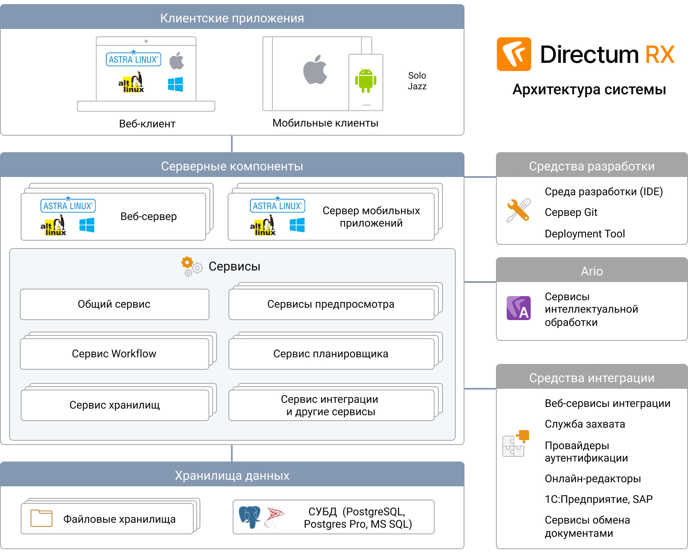

# DirectumRX

## Архитектура системы

Архитектура системы микросервисная, хорошо масштабируемая.

### Масштабируемость

Высокая производительность системы, даже при большом количестве пользователей, обеспечивается за счет того, что:

* количество веб-серверов пропорционально увеличивается при увеличении клиентских подключений. С помощью балансировки оптимизируется распределение нагрузки по серверам;

* за счет использования микросервисов, каждый из которых выполняет узкоспециализированную задачу, архитектура системы обеспечивает еще более гибкое распределение нагрузки и стабильность работы;

* файловые хранилища позволяют организовать размещение большого объема документов вне СУБД;

* архитектура поддерживает мультитенантное[1] размещение для дочерних организаций компании: общие сервисы, разные хранилища данных.

[1]: **Мультитентальность** -- это способность обрабатывать и секционировать данные на сайтах, в общих службах и приложениях, чтобы обслуживать нескольких клиентов.
